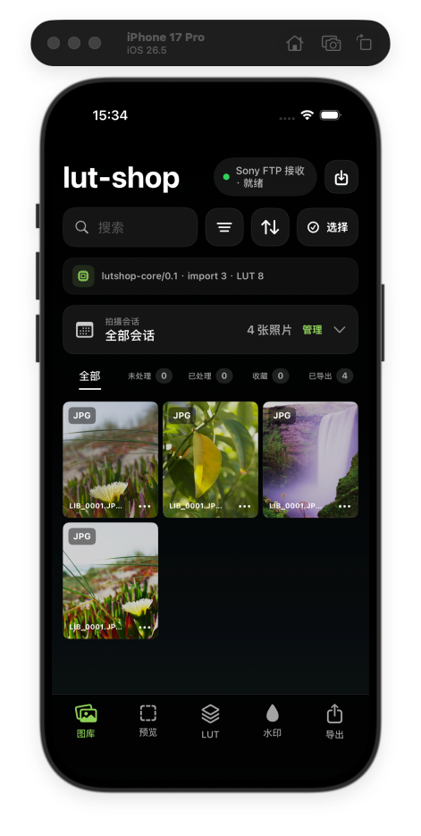
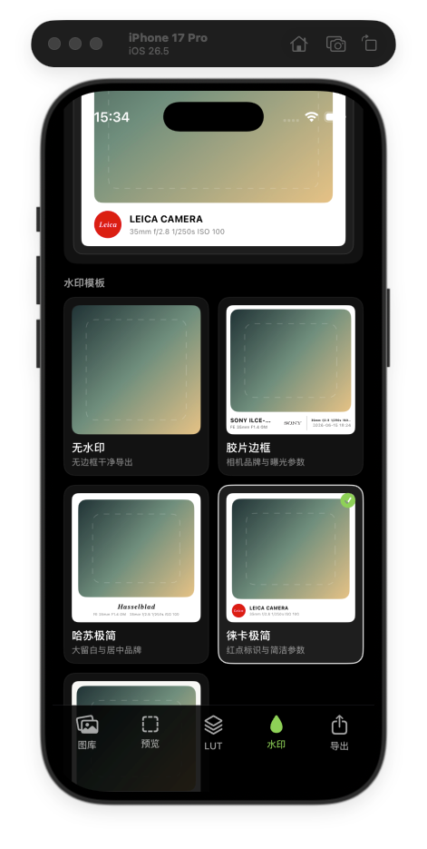
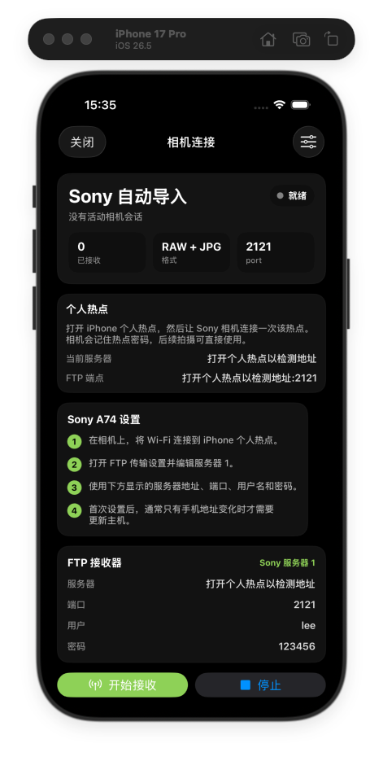

# lut-shop

lut-shop 是一个移动端优先的摄影 LUT/预设管理与照片批量处理工具，面向摄影师、修图师、内容创作者，以及需要在手机上快速导入、筛选、调色和交付照片的工作流。

当前项目同时维护 iOS SwiftUI App、Android Compose App 和跨端 C++ core。核心方向是：手机端接收照片，管理 LUT/预设，预览并应用 LUT，筛选收藏，批量同步调整，导出带 EXIF 水印的成片。

## 截图

| 图库工作台 | 水印模板 | Sony FTP 接收 |
|---|---|---|
|  |  |  |

## 当前能力

- iOS SwiftUI 和 Android Compose 双端原型。
- 从系统照片或文件导入图片，图库索引持久化。
- 图库支持会话、搜索、筛选、排序、评分、收藏、选择集和批量删除。
- 预览页支持 LUT 应用、强度调节、前后对比、保存、撤销。
- 可把当前照片保存的 LUT 和强度同步到其他已选照片。
- LUT 库支持系统分类、自定义分类、添加、重命名、删除、收藏和详情分类切换。
- 支持 `.cube` LUT，iOS 支持从本地文件、URL 和压缩包递归导入。
- 导出页按每张照片自己的已保存调整导出，不在导出阶段重新选择 LUT。
- 支持胶片边框、哈苏极简、徕卡极简、Apple 极简等水印样式。
- Sony FTP 接收基础链路已接入，账号默认 `lee`，密码默认 `123456`。
- C++ core 已接入 iOS Objective-C++ 桥和 Android JNI，用于 LUT 解析和像素处理。

## GitHub 下载 APK

项目已配置 GitHub Actions 自动打包 Android debug APK。

1. 打开 `https://github.com/coderleexl/lut-shop`
2. 进入 `Actions`
3. 选择 `Android APK`
4. 打开最新一次运行
5. 在页面底部 `Artifacts` 下载 `lut-shop-debug-apk`
6. 解压后得到 `app-debug.apk`

也可以在 `Actions > Android APK > Run workflow` 手动触发一次构建。

## macOS / iOS 快速开始

前置条件：

- macOS
- Xcode 已安装，并至少安装一个 iOS Simulator runtime
- Xcode Command Line Tools 可用

运行：

```bash
./mac.sh
```

脚本会执行：

1. 构建 `apps/ios/LutShop.xcodeproj` 的 `LutShop` scheme。
2. 自动选择一个已启动或可用的 iPhone 模拟器。
3. 覆盖安装 App。
4. 启动 `com.lutshop.app`。

只构建不启动：

```bash
./mac.sh --build-only
```

指定模拟器型号：

```bash
LUT_SHOP_DEVICE="iPhone 17 Pro" ./mac.sh
```

脚本不会卸载 App，也不会清空模拟器数据，所以已经导入的图库索引会保留。

## Android 快速开始

前置条件：

- Android Studio 或 Android SDK 可用
- JDK 17
- 如需自动安装启动，先连接 Android 设备或启动模拟器，并确保 `adb` 可用

运行：

```bash
./android.sh
```

脚本会通过 `apps/android/gradlew` 构建 debug APK。检测到 Android 设备或模拟器时，会自动安装并启动 `com.lutshop`；没有设备时只完成构建。

手动构建 APK：

```bash
cd apps/android
./gradlew assembleDebug
```

产物路径：

```text
apps/android/app/build/outputs/apk/debug/app-debug.apk
```

## 项目结构

```text
apps/ios/              iOS SwiftUI App
apps/android/          Android Compose App
core/                  跨端 C++ core
assets/                原始素材和 LUT 入口
docs/                  产品、架构、计划、截图和审计记录
mac.sh                 iOS 快速构建/安装/启动脚本
android.sh             Android 快速构建/安装/启动脚本
```

## 关键目录

```text
apps/ios/LutShop/AppState.swift                    iOS 状态、图库、导入、导出、相机接收编排
apps/ios/LutShop/Core/CameraReceiveService.swift   iOS FTP 接收服务
apps/ios/LutShop/Core/CoreImageLutRenderer.swift   iOS Core Image LUT 渲染
apps/ios/LutShop/Core/WatermarkRenderer.swift      iOS 水印导出渲染
apps/ios/LutShop/Views/                            iOS Gallery / Preview / LUT / Watermark / Export UI

apps/android/app/src/main/java/com/lutshop/AppState.kt                    Android 状态和业务编排
apps/android/app/src/main/java/com/lutshop/data/AndroidFtpReceiveService.kt Android FTP 接收服务
apps/android/app/src/main/java/com/lutshop/core/LutShopCoreBridge.kt       Android JNI / C++ bridge
apps/android/app/src/main/java/com/lutshop/export/                         Android 导出和水印渲染
apps/android/app/src/main/java/com/lutshop/ui/                             Android Compose UI

core/include/lutshop/bridge_c.h                     C ABI bridge
core/src/cube.cpp                                   .cube LUT 解析和像素处理
```

## 产品交互说明

### 图库选择集

图库里的“选择”会进入选择模式。点“完成”只退出选择模式，不清空选择集；已选照片在普通浏览状态下会保留白色边框。再次进入选择模式时会显示当前选择数量。清空选择使用“清空”按钮。

### 调色与同步

单张照片在预览页选择 LUT、调整强度后，需要点“保存”。如果图库里已有其他已选照片，可以在详情页点“同步到已选”，把当前照片已保存的 LUT 和强度同步给其他已选照片，当前照片本身不会重复处理。

### 导出

导出不再选择 LUT。导出页只读取每张照片自己的已保存状态：

- 有已保存 LUT：导出处理后效果。
- 无已保存 LUT：导出原图。

导出格式、尺寸、质量、EXIF 和水印样式仍在导出页设置。

### Sony FTP 接收

手机端作为 FTP 服务器，相机作为 FTP 客户端主动上传照片。

推荐使用方式：

1. 手机开启热点。
2. Sony 相机连接手机热点。
3. 在 App 的“相机接收”界面点击“开始接收”。
4. 在相机 FTP 服务器设置中填入 App 显示的 IP、端口、用户名和密码。
5. 相机上传的新照片会自动进入当天图库会话。

接收服务不会因为返回图库而停止，只有手动点击“停止接收”才会关闭。

## Android LUT 性能说明

当前 Android LUT 应用路径是 CPU/JNI 实现：Kotlin 解码整张图，复制像素数组到 JNI，C++ 解析 `.cube` 并逐像素三线性采样，然后再压 JPEG 写盘。大图上会比 iOS Core Image 慢。

后续优化方向：

- 预览使用降采样图，不对原图实时计算。
- 缓存 `.cube` 解析结果。
- 预览和保存分离：预览走快路径，保存走全质量路径。
- 中期接入 GPU shader / OpenGL ES / Vulkan 预览链路。

## 备注

当前仓库仍是快速迭代阶段，iOS 和 Android 的交互会继续对齐。debug APK 适合真机体验和功能验证；正式分发还需要配置 release 签名、版本号和隐私说明。
